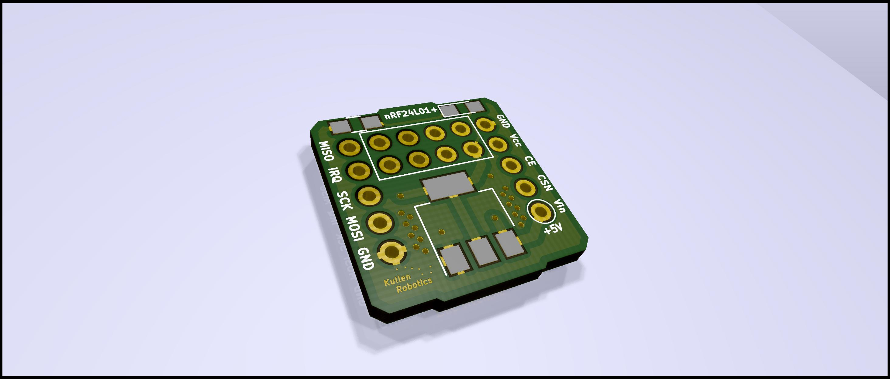
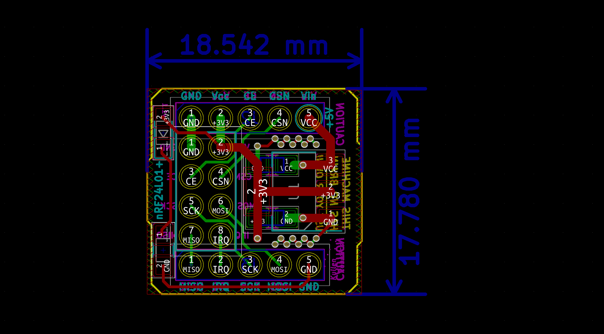

# NRF24L01 Breakout Board

A simple little 18x19mm breakout board to make the NRF24L01+ RF tranceiver reasonably breadboard-friendly.

Components:

* 2x 1x5 pin header
* 1x 2x4 socket header
* 1x AZ1117-3.3 voltage regulator (SOT-223)
* 2x 0805 SMD 10uF capacitor
* 1x 0805 SMD LED
* 1x 1kohm 0805 SMD resistor
